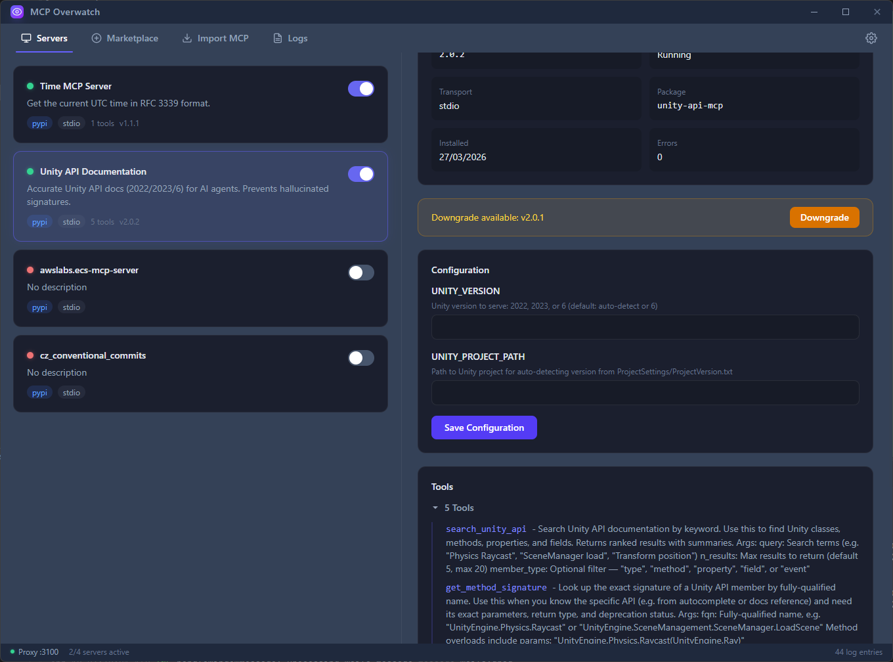

# MCP Overwatch

**A unified gateway for Model Context Protocol servers.**

MCP Overwatch is a cross-platform desktop app that lets you browse, install, configure, and supervise MCP servers from one place — and exposes them to Claude Desktop, Claude Code, and any other MCP-aware client through a single proxy endpoint.



---

## Why?

Running more than one or two MCP servers gets unwieldy fast. Each client has its own config file, each server has its own command line, environment variables, secrets, and update cadence. There's no easy way to see what's actually running, read its logs, or restart it without editing JSON by hand.

MCP Overwatch fixes that:

- **One place to install servers** — browse the official MCP registry, install with a click, and the app handles downloading the right runtime (Node, Python, Docker) and wiring up secrets via your OS keychain.
- **One endpoint for every client** — Claude Desktop, Claude Code, and anything else that speaks MCP connect to a single HTTP proxy on `localhost:3100`. Tools are auto-namespaced (`slack__send_message`, `github__create_issue`) so there are no collisions.
- **You can see what's happening** — a unified live log stream you can filter by server, crash recovery with backoff, and update notifications when new versions land in the registry.
- **Minimises to the tray** and keeps your servers running while you work.

## Features

- 🔍 Browse the official MCP registry, filter by runtime and transport
- ⚙️ Install, configure, start/stop, and update servers from the UI
- 🔐 Secrets stored in the OS keychain (Keychain / Credential Manager / Secret Service)
- 🌐 Unified HTTP proxy on `:3100` with tool namespacing
- 📜 Real-time unified log stream with per-server filtering, backed by a 10k-entry ring buffer
- 📊 Per-server and per-tool usage stats: call counts, error rates, avg/p95/max latency, and hourly activity
- 🔄 Auto-restart on crash with exponential backoff
- 🖱️ System tray with active-server count, minimise-to-tray behaviour
- 🪟 Cross-platform: Windows, macOS (universal), Linux (AppImage/deb/rpm)
- 🔌 One-click integration with Claude Desktop and Claude Code configs

## Install

Download the latest release for your platform from the [Releases page](https://github.com/amnuts/mcp-overwatch/releases).

| Platform | File |
|---|---|
| Windows (x64) | `mcp-overwatch-<version>-windows-amd64-installer.exe` |
| Windows (ARM64) | `mcp-overwatch-<version>-windows-arm64-installer.exe` |
| macOS (universal) | `mcp-overwatch-<version>-macos-universal.zip` |
| Linux (AppImage) | `mcp-overwatch-<version>-linux-amd64.AppImage` |
| Linux (Debian/Ubuntu) | `mcp-overwatch-<version>-linux-amd64.deb` |
| Linux (RHEL/Fedora) | `mcp-overwatch-<version>-linux-amd64.rpm` |

### Requirements

- **Windows**: 10 or later. The installer will download WebView2 Runtime if it's missing. The installer is **unsigned**, so Windows SmartScreen will show a *"Windows protected your PC"* warning on first run — click *More info* → *Run anyway* to proceed. (Code-signing certificates are prohibitively expensive for an unfunded OSS project.)
- **macOS**: 10.15 Catalina or later. Builds are ad-hoc signed; on first launch, right-click → *Open* to bypass the Gatekeeper warning (or purchase a Developer ID and notarize your own build).
- **Linux**: GTK 3 and WebKit2GTK 4.1. On Debian 12 / Ubuntu 22.04+ install with `sudo apt install libgtk-3-0 libwebkit2gtk-4.1-0`.

## First-time setup

1. Launch MCP Overwatch. It creates its data directory at `{UserConfigDir}/MCPOverwatch/`.
2. The registry syncs in the background on first launch. Browse the **Marketplace** tab and install a server you want to try.
3. Open **Settings → Clients** and click *Register with Claude Desktop* or *Register with Claude Code*. This writes a single entry into their config that routes everything through Overwatch's proxy.
4. Restart Claude Desktop / Claude Code. Your tools are now available, namespaced per server.

## Configuration

Config lives at `{UserConfigDir}/MCPOverwatch/config.toml`. Defaults:

| Setting | Default |
|---|---|
| Proxy port | `3100` |
| Log ring buffer | `10000` entries |
| Registry sync interval | `24h` |
| Log retention | `7 days` |
| Stats retention | `90 days` |

Secrets (server env vars you mark as sensitive) are stored in the OS keychain, keyed as `mcp-overwatch:{server_id}:{env_var_name}`.

## Development

```bash
# Prerequisites: Go 1.25+, Node 22+, Wails v3 alpha CLI
go install github.com/wailsapp/wails/v3/cmd/wails3@v3.0.0-alpha.78

# Run in dev mode (hot reload)
wails3 dev -config ./build/config.yml

# Build for the current OS
wails3 task build

# Package for the current OS (.app / installer / AppImage+deb+rpm)
wails3 task package

# Run tests
go test ./internal/...

# Regenerate frontend TypeScript bindings after changing Go service signatures
wails3 generate bindings
```

## Architecture

- Backend: Go + [Wails v3](https://v3alpha.wails.io/) + [mcp-go](https://github.com/mark3labs/mcp-go), SQLite via pure-Go `modernc.org/sqlite` (no CGo for the DB — Wails still needs it for WebKit on macOS/Linux).
- Frontend: React 18 + TypeScript 5 + Vite 5 + Tailwind 4.

## Author

MCP Overwatch is built by [Andrew Collington](https://github.com/amnuts). Bug reports and feature requests are welcome on the [issue tracker](https://github.com/amnuts/mcp-overwatch/issues).
